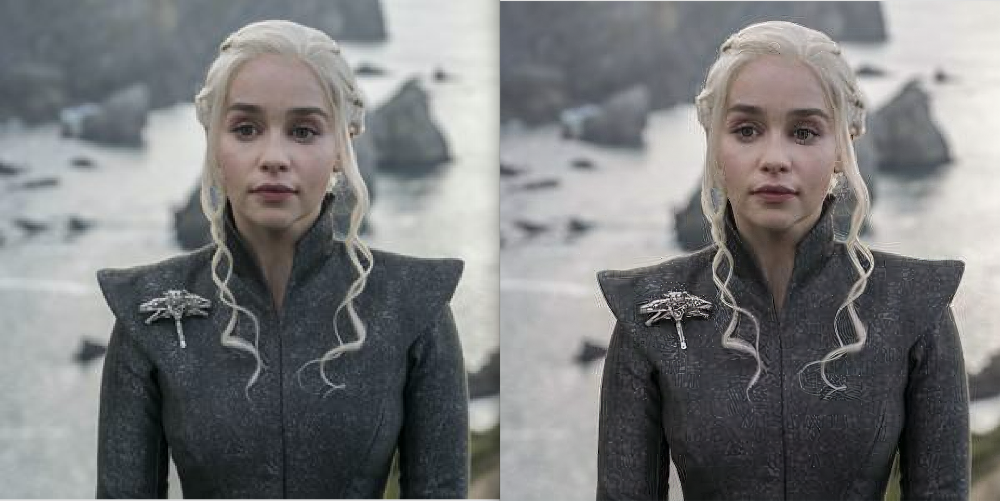
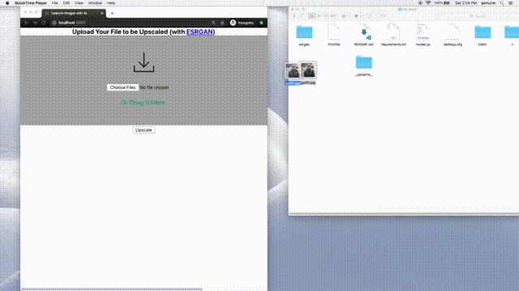
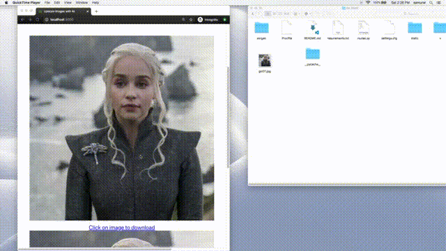

# Image Upscaler with [ESRGAN](https://github.com/xinntao/ESRGAN/)
- Allow user to submit image through **React** front end with drag and drop or file select
- **Flask** (Python) API handles request and upscales image using ESRGAN and returns base64
- allows user to view both images before and after upscaling
- allows user to download upscaled image  
---
### Before & After
 
 
---
### Usage

